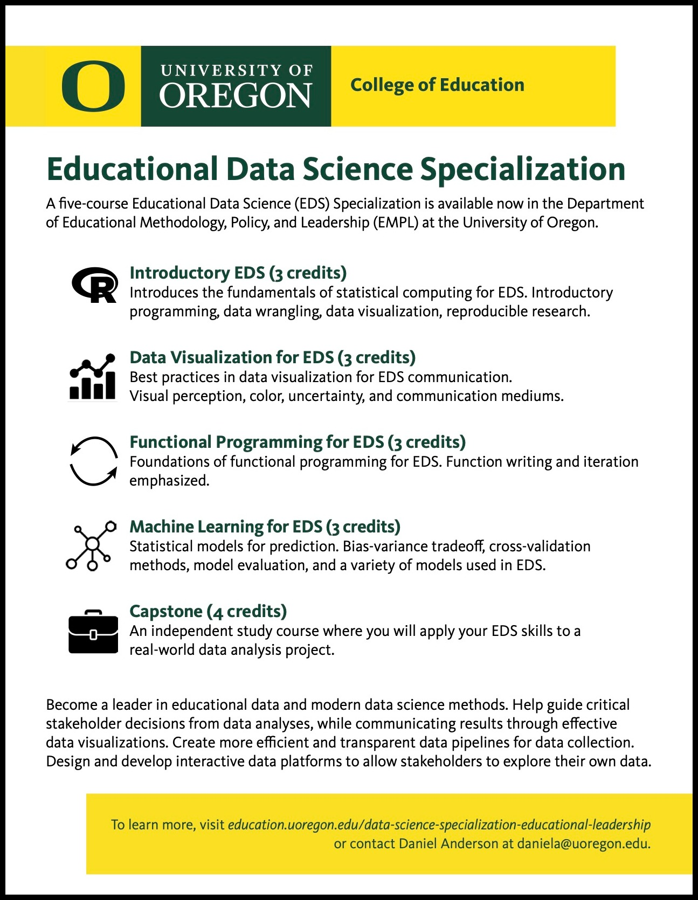

Below is a curated list of resources I've generally found to be particularly useful and accessible. If you come across other great resources that you think you should be on this list, please [let me know](mailto:bcullen@uoregon.edu)!

***

 

## Books (free and online)

:::book
1. [R for Data Science](https://r4ds.had.co.nz/) -- thorough and accessible, includes exercises and community-contributed [solutions](https://jrnold.github.io/r4ds-exercise-solutions/)

2. [Modern Dive](https://moderndive.netlify.app/) -- great for complete beginners, more focused on stats and modelling

3. [The Tidyverse Style Guide](https://style.tidyverse.org/) -- for getting into the habit of using best practices early on

4. [Big Book of R](https://www.bigbookofr.com/) -- one stop shopping for pretty much any R-related book that's out there (categorized by topic and searchable)
:::

 

## Websites -- add to your bookmarks! 

:::link
1. RStudio Education's [learning resources](https://education.rstudio.com/learn/) and [blog](https://education.rstudio.com/blog/) -- a veritable treasure trove!

2. [RStudio cheatsheets](https://rstudio.com/resources/cheatsheets/) -- worth printing ones you commonly use if you are able to

3. [tidyverse.org](https://www.tidyverse.org/packages/) -- links to [learning resources](https://www.tidyverse.org/learn/), [package documentation](https://www.tidyverse.org/packages/), and a great [blog](https://www.tidyverse.org/blog/) to stay up to date

4. [learnr4free](https://www.learnr4free.com/en/index.html) -- a searchable site for all sorts of learning resources 
:::

 

## Interactive tutorials 

:::demo
1. [RBootcamp](https://r-bootcamp.netlify.app/) -- a free online course about the basics of the tidyverse

2. [RStudio primers](https://rstudio.cloud/learn/primers) -- these, along with other tutorials, can also be run in the [Tutorial pane](https://rstudio.github.io/rstudio-extensions/rstudio-tutorials.html) in the RStudio IDE

3. [Teacup Giraffes](https://tinystats.github.io/teacups-giraffes-and-statistics/index.html) -- more stats focused, with incredible artwork and adorable tiny giraffes `r emo::ji("giraffe")`
:::

 

## Online communities 

:::people

1. [R for Data Science Online Learning Community](https://www.rfordatasci.com/) -- super friendly and welcoming to R users at all levels

2. #rstats Twitter -- also very friendly and inclusive (despite being Twitter). Good advice on this [here](https://www.t4rstats.com/index.html#what-you-can-get-out-of-twitter)

3. [Tidy Tuesday](https://github.com/rfordatascience/tidytuesday) -- a weekly community-based data viz challenge on Twitter. Great for hands-on, self-directed practice! 

4. [RStudio Community](https://community.rstudio.com/t/welcome-to-the-rstudio-community/8) -- great for asking for help from knowledgable experts

:::

 

## At University of Oregon

:::uo

1. 5-course [Educational Data Science Specialization](https://education.uoregon.edu/data-science-specialization-educational-leadership) offered by UO College of Education, led by [Daniel Anderson](https://education.uoregon.edu/people/faculty/daniela). See course websites [here](https://github.com/uo-datasci-specialization) and [info sheet](EDS.jpg) below. Cannot recommend highly enough! `r emo::ji("star")` `r emo::ji("star")` `r emo::ji("star")` `r emo::ji("star")` `r emo::ji("star")`

2. UO Psych Data Analysis Sequence (PSY611, PSY612, PSY613), led by [Sara Weston](https://psychology.uoregon.edu/profile/sweston2/) and [Elliot Berkman](https://psychology.uoregon.edu/profile/berkman/). See course websites [here](https://github.com/uopsych) -- you will learn a TON.

3. Free R workshops offered by [Data Services](https://library.uoregon.edu/data-services), a branch of UO Libraries. Includes a ["Master the Tidyverse"](https://researchguides.uoregon.edu/library_workshops/tidyverse) series.

4. [SlackRs workspace](https://uodatascience.slack.com/) -- use this to ask for help from other UO community members when you're stuck on something or need some advice. 

5. Each other! As grad students, one of the best resources you have access to is your peers. You can read more of my thoughts about this [here](https://bcullen.rbind.io/post/2020-03-08-data-science-training-needs-in-grad-school/). When in doubt, ask for help -- and pay it forward if/whenever you can. `r emo::ji("heart")`
:::

 

***

