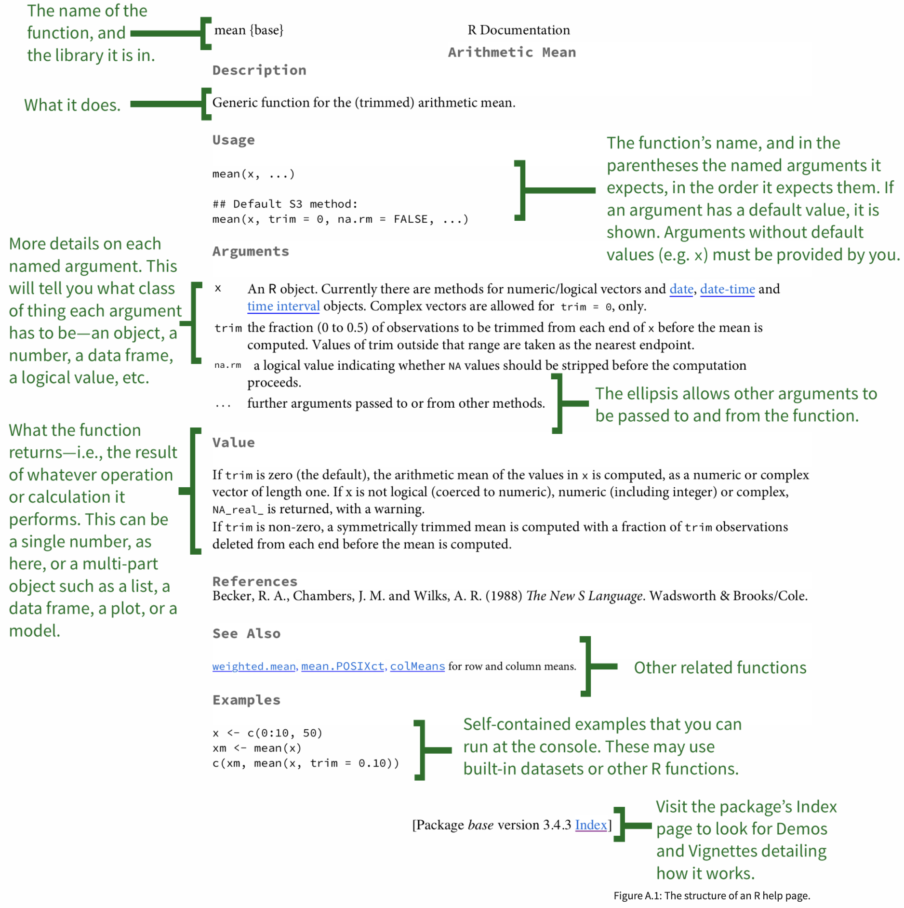
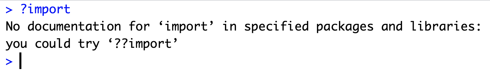
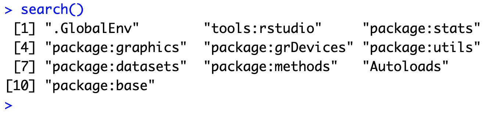
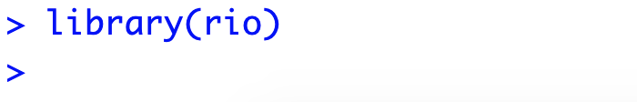
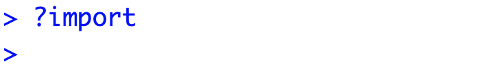
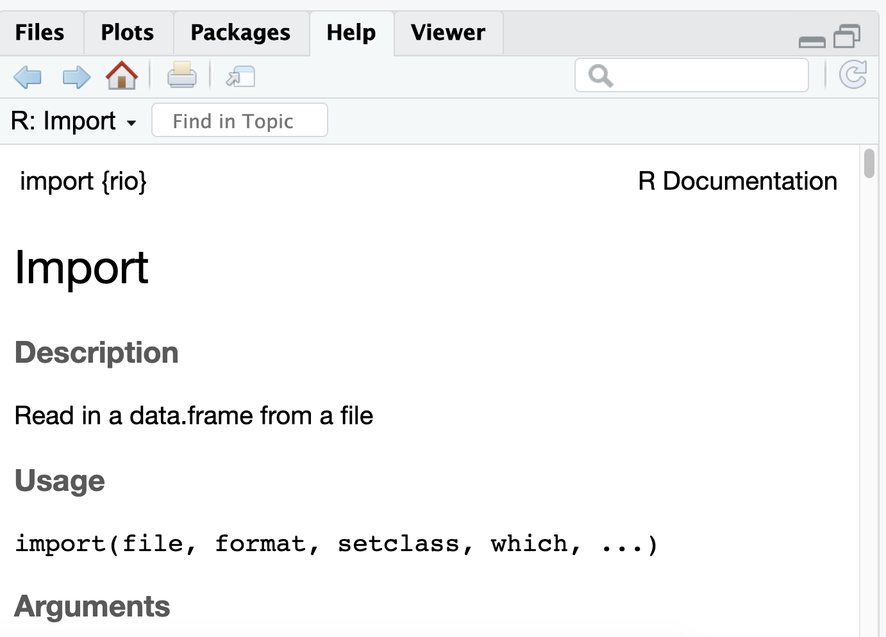
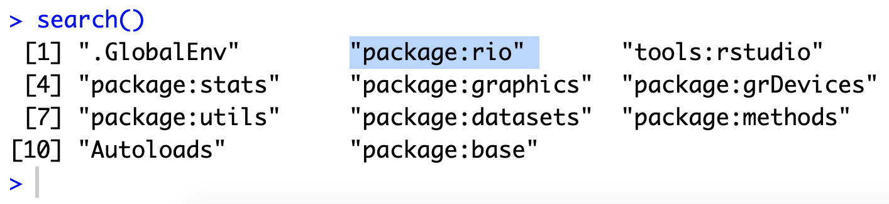
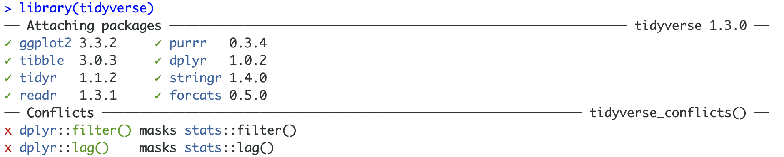
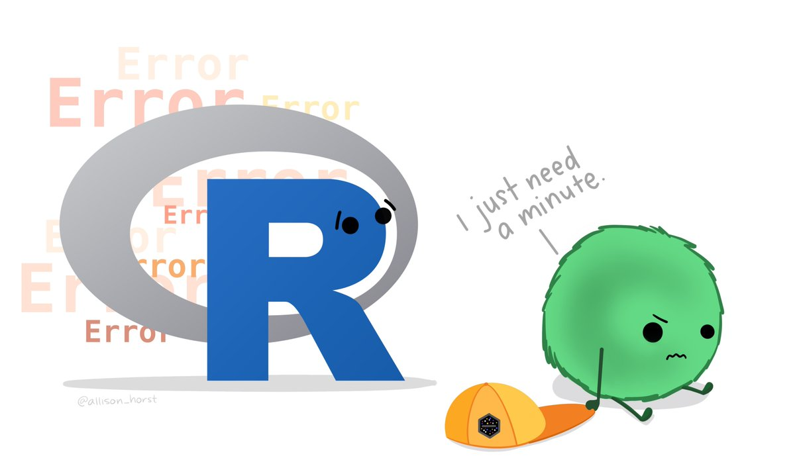
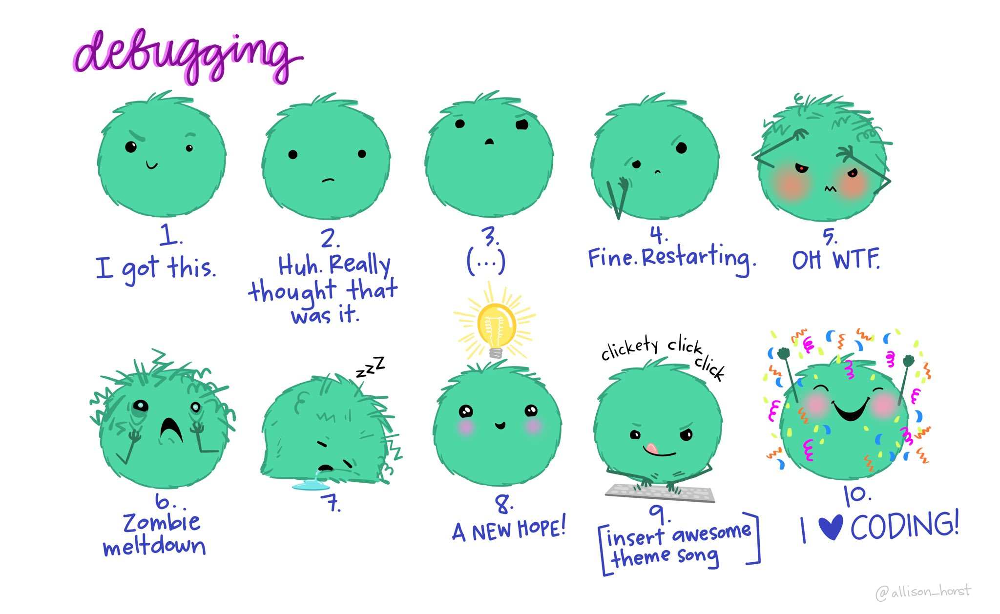

```{r setup, include=FALSE}
options(htmltools.dir.version = FALSE)
library(countdown)

xaringanExtra::use_xaringan_extra(include = c("panelset", "tile_view", "share_again"))
xaringanExtra::style_share_again(share_buttons = c("twitter", "linkedin", "pocket"))

# your turn counter
yt_counter <- 0
```

```{r xaringan-themer, include=FALSE, warning=FALSE}
library(xaringanthemer)
style_mono_accent(base_color = "#23395b",
                text_font_google = google_font("Montserrat", "300", "300i"),
                code_font_google = google_font("Source Code Pro"),
                link_color = "#BA8800",
                code_inline_color = "#BA8800")
```

class: title-slide, center, middle

# Functions & Debugging

---
# Functions

Data (and objects more generally) are one of the building blocks of R. The other is **functions**. 

--

We've already used a handful of functions, including `seq()`, arithmetic functions (`+`, `*`, etc.), `c()`, `list()`, `data.frame()`, `str()`, etc.

--
***

Functions take some form of an input, perform some operation, and then return some object(s) as output.

--

Functions are made up of **arguments**.

---
# Functions

Let's take another look at the help documentation for `seq()`... `r icon::fa("cloud")`
 
```{r eval=FALSE}
?seq
```

--
***

You can see it has the arguments `from`, `to`, `by`, `length.out`, and `along.with`.

--

You might also notice that each of the arguments have a value after the `=` in the documentation. 

--

These values are the **defaults**; they are what the arguments will be set to if you don't specify them. 

--
***

In fact, since all of the arguments have defaults, we don't have to specify any to run `seq()` as we saw earlier.

```{r}
seq()
```

---
# Functions

Let's take a look at a new function, `mean()`... `r icon::fa("cloud")`

---
# Functions

```{r echo=FALSE, out.width="65%"}

```

.footnote[Image from [Kieran Healy](https://socviz.co/appendix.html#a-little-more-about-r)]
---
# Functions

What happens if we run `mean()` without any arguments?

```{r error=TRUE}
mean()
```

--
***

We get an error telling us that the argument `"x"` is missing and has no default. 

--

Whenever you see this error, it means you are missing a required argument (i.e., an argument without a default). 

--

If we look at the help documentation, you can see `x` is the data from which to calculate a mean.

---
# Functions

Let's create some data to calculate the mean of. 

```{r}
vec <- c(1, 2, 3, 4, 5, 6, 2, 4)
```

--

Now let's take the mean of `vec`.

```{r}
mean(x = vec)
```

--
***

Note that `mean()` has two more optional arguments listed: 

+ `trim`, which returns a trimmed mean

+ `na.rm`, which takes a logical value indicating if it should remove missing values or not before it calculates the mean (`FALSE` by default). 

---
# Functions

What happens if we don't remove `NA`s before calculating the mean? Let's check it out...

--

```{r}
vec_na <- c(1, 2, 3, 4, 5, 6, NA, 2, 4)
```

--

```{r}
mean(vec_na)
```

--
***

It returns `NA`. NAs are contagious! A single `NA` in a vector will cause many functions to return `NA` (unless they remove them by default). 

--

This sort of makes sense - the mean of `vec_na` in its entirety is unknown, since we don't know what the `NA` value is. That's why you have to remove `NA`'s before running calculations by setting `na.rm = TRUE`

--

```{r}
mean(vec_na, na.rm = TRUE)
```

---
class: inverse
# Your turn `r (yt_counter <- yt_counter + 1)`

```{r echo=FALSE}
countdown(minutes = 2)
```

1. Look up the help documentation for the function `sd()` (type directly in the RStudio console)

1. Calculate the standard deviation of `vec_na`. Be sure to remove missing values first. 

```{r}
vec_na <- c(1, 2, 3, 4, 5, 6, NA, 2, 4)
```

---
class: solution

# Solution

.panelset[
.panel[.panel-name[Q1]

```{r eval=FALSE}
?sd
```
]
.panel[.panel-name[Q2]

```{r}
sd(vec_na, na.rm = TRUE)
```

]
]

---
# Functions

You can get the length of many objects with `length()`

```{r}
length(vec_na)
```

--
***

`nrow()` and `ncol()` can be used to get the number of rows or columns in a matrix or data frame. Let's look at the data frame `df` below

```{r echo=FALSE}
df <- data.frame(a = c(1, 2),
                 b = c(3, 4),
                 c = c(5, 6),
                 d = c(7, 8))

df
```

.panelset[
.panel[.panel-name[nrow]

```{r}
nrow(df)
```
]

.panel[.panel-name[ncol]

```{r}
ncol(df)
```
]

.panel[.panel-name[length]

The length of a data frame is the same as the number of columns. 

```{r}
length(df)
```

]
]

---
# Functions

Take another look at the help documentation for `sd()` `r emo::ji("eyes")`. 

Notice that there are two arguments and they are in order, `x` followed by `na.rm = FALSE`. 

--
***

You can set arguments explicitly by *name*

```{r}
sd(x = vec_na, na.rm = TRUE)
```

--
***

You can also set them *positionally* and drop the argument names

```{r}
sd(vec_na, TRUE)
```

---
# Functions

When using arguments positionally (without their names), **make sure the arguments are in the right order.** 

--

Otherwise you can end up with weird errors or warnings. 

```{r error=TRUE}
sd(TRUE, vec_na)
```

--
***

However, if you explicitly name the arguments, you can actually put them in a different order. This isn't recommended unless there is a good reason though...

```{r}
sd(na.rm = TRUE, x = vec_na)
```

---
# Packages

So far, we've been working with functions that are already installed and loaded when we open R.

--

However, many of the functions we want access to to use are not part of the basic R install. They come in **packages** that other R users create and share.

--

Most packages can be accessed from [**CRAN**](https://cran.r-project.org/) - the Comprehensive R Archive Network. 

---
# Packages

The most common way to get a package is to download it from CRAN using `install.packages("package_name")` -- notice the quotes.

--
***

For example, one package we're going to use tomorrow is `rio`, which has really easy functions for importing and exporting data. 

If we wanted to install the `rio` package, we would use 

```{r eval=FALSE}
install.packages("rio")
```

--
***

A couple notes here. 

1) You will sometimes see package names written inside `{}`, e.g. `{rio}`. 

--

2) To make things easier in our online format, I have pre-installed all the packages we will be needing on RStudio Cloud. 

--

However, in order to access the functions from these packages, we still need to *load* them...

---
# Packages 

Installing a package puts a copy of it into our personal library that R has access to. In general, we only need to install a package once.

--
***

However, whenever we want to to use a package, we need to load the package in our working session in RStudio. 

We load packages with the `library()` function, we do this once *per session*.

--
***

Loading a package basically makes the contents of that package searchable by R. 

In other words, after loading a package, R is able to find the functions included in that packages. 

You can see what functions are available in your workspace by running the `search()` function

---
class: inverse
# Your turn `r (yt_counter <- yt_counter + 1)`

```{r echo=FALSE}
countdown(minutes = 3)
```

1. In your RStudio console, look up the help documentation for`import()` by typing `?import`. What do you see?

1. Run `search()` in the console. Is the `rio` package included in this list?
 
1. Again in the console, load the `rio` package using the `library()` function. 

1. Now look again at the help documentation for `import()`. What do you see this time?

1. Run `search()` again. What is different this time?

---
class: solution
# Solution

.panelset[
.panel[.panel-name[Q1]

```{r echo=FALSE}

```
]

.panel[.panel-name[Q2]

```{r echo=FALSE}

```
]

.panel[.panel-name[Q3]

```{r echo=FALSE, out.width="60%"}

```
]

.panel[.panel-name[Q4]

```{r echo=FALSE, out.width="60%"}

```


```{r echo=FALSE, out.width="60%"}

```

]

.panel[.panel-name[Q5]

```{r echo=FALSE}

```
]
]

---
# Packages

Another package we're going to use a lot going forward is `tidyverse`. 

`tidyverse` is actually a "meta-package", meaning it contains many individual packages inside of it that are all bundled together. 

--
***

When we load `tidyverse` we get quite a bit of info. 

<br>
```{r echo=FALSE}

```

---
# Packages

Conflicts occur when the same name is used for different things. 

--

For example, the `dplyr` package and the `stats` package (preloaded) both have a function called `filter()`. 

--

When we call `filter()`, R will only call one of those functions and it might not be the one we want. 

--
***

Which one will R choose? R has an order in which it searches...

--

It starts with the Global Environment, then searches packages in the order that they were loaded, searching more recently loaded packages first.

--
***

You can tell R explicitly that you want a function from a particular package using the notation `package::function_name`. When in doubt, it's better to use the double colon operator to be specific about which function you want.

---
class: inverse
# Your turn `r (yt_counter <- yt_counter + 1)`

```{r echo=FALSE}
countdown(minutes = 1)
```

1. Look up for the help documentation for `filter()` from the `stats` package.

1. Now look up the help documentation for `filter()` from the `dplyr` package.

---
class: solution
# Solution

.panelset[
.panel[.panel-name[Q1]

```{r eval=FALSE}
?stats::filter
```
]

.panel[.panel-name[Q2]

```{r}
?dplyr::filter
```
]
]

---
# Debugging

Before we wrap up, let's talk about error messages.

--

You will run into them constantly, even when using functions you've used many times before -- and especially when using functions/packages that are new to you.

```{r echo=FALSE, out.width="80%"}

```

.footnote[Artwork by [@allison_horst](https://twitter.com/allison_horst)]

---
# Debugging

We're not going to go into details of debugging, because that could (and should) be a whole course on its own. 

But there are a few general things to be aware of...

--
***

.pull-left[
+ Google is your best friend -- it is *very* likely someone else has had your exact same problem/question before

+ Some helpful forums are [StackOverflow](https://stackoverflow.com/), [RStudio Community](https://community.rstudio.com/), [CrossValidated](https://stats.stackexchange.com/)

+ When asking for help, it's best to provide as much context as possible -- best case scenario is to provide a [reproducible example](https://www.tidyverse.org/help/)
]

.pull-right[

```{r echo=FALSE}

```
]

.footnote[Artwork by [@allison_horst](https://twitter.com/allison_horst)]

---
class: inverse, center, middle
# Q & A

```{r echo=FALSE}
countdown(minutes = 5)
```

---
class: inverse, center, middle
# Next up...

## Introduction to the Tidyverse
