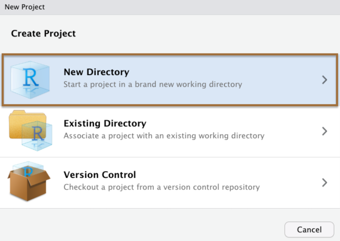
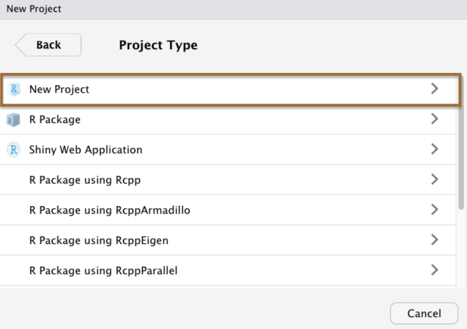
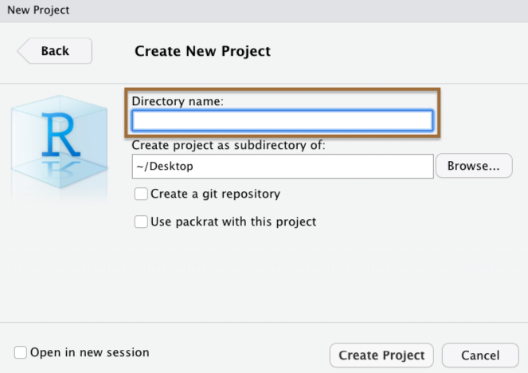

```{r setup, include=FALSE}
options(htmltools.dir.version = FALSE)
library(countdown)
library(tidyverse)

xaringanExtra::use_xaringan_extra(include = c("panelset", "tile_view", "share_again"))
xaringanExtra::style_share_again(share_buttons = c("twitter", "linkedin", "pocket"))

# your turn counter
yt_counter <- 0
```

```{r xaringan-themer, include=FALSE, warning=FALSE}
library(xaringanthemer)
style_mono_accent(base_color = "#23395b",
                text_font_google = google_font("Montserrat", "300", "300i"),
                code_font_google = google_font("Source Code Pro"),
                link_color = "#BA8800",
                code_inline_color = "#BA8800")
```

class: title-slide, center, middle

# Importing Data & Workflows

---

# Importing data

Importing data in R generally has 2 commonly challenging aspects...

--

1. You need to call a function that works with a particular data format (`.csv`, `.txt`, `.sav`, etc.)

--

2. You need to tell R where to look for the data

---
# Importing data

### Challenge # 1: File types

--

.pull-left[

.center[
### `readr`

```{r echo=FALSE, out.width="55%"}
knitr::include_graphics("images/hex/readr.png")
```

`read_csv()`, `read_tsv()`, `read_delim()`, `read_fwf()`, etc...
]
]

--

.pull-right[

.center[
### `rio`

```{r echo=FALSE, out.width="55%"}
knitr::include_graphics("images/hex/rio.png")
```

`import()`
]
]

---

# Importing data

### Challenge # 1: File types


.pull-left[

.center[
### `readr`

```{r echo=FALSE, out.width="55%"}
knitr::include_graphics("images/hex/readr.png")
```

`read_csv()`, `read_tsv()`, `read_delim()`, `read_fwf()`, etc...
]
]


.pull-right[

.center[
### `rio`

```{r echo=FALSE, out.width="55%"}
knitr::include_graphics("images/hex/rio.png")
```

`import()`

`r emo::ji("check")`
]
]

---
# Importing data

### `rio::import()`

We just call `import()` and under the hood it calls the right read function given the file's extension (`.csv`, `.txt`, `.sav`, `.xlsx`, etc.)

--

We'll get some practice with this in a few minutes

---
# Project-oriented workflows

### Challenge # 2 : File paths

--

When R looks for a file, it has a starting point. This is called the **working directory**. 

--

The working directory that you're currently in is displayed in the console window and the files tab. Let's take a look in RStudio... `r icon::fa("cloud")` 

--
***

If you ever get lost, you can print your working directory with `getwd()`

--

If you are working in a `.Rmd` document, R by default will set whatever folder on your computer where that `.Rmd` file lives as your working directory 

--

```{r}
getwd()
```

For example, I created these slides in a `.Rmd` document that lives in this folder on my computer `r emo::ji("point_up")`

---
class: split-three
# Project-oriented workflows

### RStudio Projects

The best way to simplify issues with working directories is to use **RStudio Projects**. 

--
***

.column[.content[.center[
<br><br><br><br><br><br><br><br><br><br><br><br><br>

### Step 1
```{r echo = FALSE, out.width="90%"}

```
]]]

.column[.content[.center[
<br><br><br><br><br><br><br><br><br><br><br><br><br>

### Step 2
```{r echo = FALSE, out.width="90%"}

```


]]]

.column[.content[.center[
<br><br><br><br><br><br><br><br><br><br><br><br><br>

### Step 3
```{r echo = FALSE, out.width="90%"}

```

]]]

---
# Project-oriented workflows

### RStudio Projects

When you create a Project in RStudio, it is associated with a folder somewhere on your computer. 

It will automatically create a `.Rproj` file in that folder, which will keep track of the "top level" of your project. 

--
***

For example, we've been using RStudio Projects for "Your Turn" exercises

```{r echo=FALSE}
knitr::include_graphics("images/example_rproj.png")
```

---
# Project-oriented workflows

### `here::here()`

--

.pull-left[
In combination with RStudio Projects, use the `here` package

`here::here()` will build a file path to the top level of your project directory. 

This makes it easy to tell R where files live relative to the top-level folder of your project

]

.pull-right[
```{r echo=FALSE}
knitr::include_graphics("images/here.png")
```
]

---
# Your turn `r (yt_counter <- yt_counter + 1)`

```{r echo=FALSE}
countdown(minutes = 2, seconds = 30)
```


