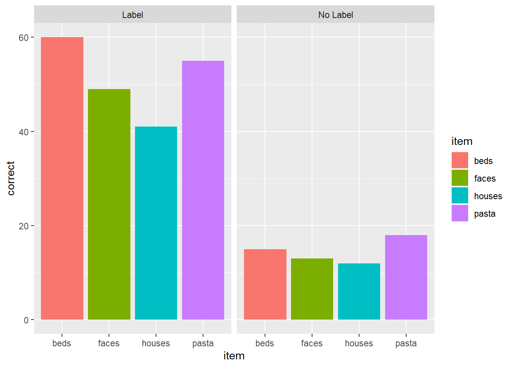

```{r setup, include=FALSE}
options(htmltools.dir.version = FALSE)
library(countdown)
library(tidyverse)
library(flipbookr)

xaringanExtra::use_xaringan_extra(include = c("panelset", "tile_view", "share_again"))
xaringanExtra::style_share_again(share_buttons = c("twitter", "linkedin", "pocket"))
xaringanExtra::use_extra_styles(hover_code_line = TRUE, mute_unhighlighted_code = TRUE)

# your turn counter
yt_counter <- 0
```

```{r xaringan-themer, include=FALSE, warning=FALSE}
library(xaringanthemer)
style_mono_accent(base_color = "#23395b",
                text_font_google = google_font("Montserrat", "300", "300i"),
                code_font_google = google_font("Source Code Pro"),
                link_color = "#BA8800",
                code_inline_color = "#BA8800")
```


class: title-slide, center, middle

# Data visualization with `ggplot2`

---
background-image: url(images/hex/ggplot2.png)
background-position: 90% 5%
background-size: 10%

# ggplot

`ggplot2` is a `tidyverse` package for data visualization. It follows the **"grammar of graphics"**

--

Even with just a few of its functions, it can make beautiful, publication-ready plots. 

--

Its more advanced features add even more versatility. 

--

People make companion packages that allow you to do even more, e.g., `ggpubr` to  add statistics to your plot -- you'll use this in gradstats. 


---
background-image: url(images/hex/palmerpenguins.png)
background-position: 90% 5%
background-size: 10%

# Palmer penguins

We're going to use the **Palmer Penguins** dataset as an example throughout our discussion of `ggplot`.

--

This data comes from the `palmerpenugins` package, which you can download from CRAN using `install.packages("palmerpenguins")`. 

--

And remember, to load the package, use `library(penguins)`, which will give you access to the built-in dataset, called `penguins`

--

.center[
```{r echo=FALSE, out.width="60%"}
knitr::include_graphics("images/penguins.png")
```
]

---

background-image: url(images/hex/palmerpenguins.png)
background-position: 90% 5%
background-size: 10%

# Palmer penguins

```{r warning=FALSE, message=FALSE}
library(palmerpenguins)
glimpse(penguins)
```

---
background-image: url(images/hex/ggplot2.png)
background-position: 90% 5%
background-size: 10%

# ggplot2

When creating a plot in ggplot2, the first thing you have to do is call the `ggplot()` function. 

--

It takes data as its first argument. Let's start there...

--

.panelset[
.panel[.panel-name[Code]

```{r plot-1, eval=FALSE}
ggplot(data = penguins)
```

]

.panel[.panel-name[Plot]

```{r plot-1-out, ref.label="plot-1", echo=FALSE, fig.dim=c(4.8, 4.5)}
```
]
]

---
background-image: url(images/hex/ggplot2.png)
background-position: 90% 5%
background-size: 10%

# ggplot2

All we got was a blank square! 

--

To understand why, let's back up to the philosophy of `ggplot`...

---
background-image: url(images/hex/ggplot2.png)
background-position: 90% 5%
background-size: 10%

# ggplot2

### What is a statistical graphic? 

--

According to  [Hadley Wickham](http://www.tandfonline.com/doi/abs/10.1198/jcgs.2009.07098), we can think of statistical graphics as:

--
* **Mappings** from data to aesthetic attributes (color, shape, size) 
* Consisting of **geometric objects** (points, lines, bars)
* On a particular **coordinate system** (or scale)
* Sometimes derived from a statistical **transformation**

--
***

In `ggplot`, that combination of things forms a *layer*. The `ggplot` terminology is:

--

* **aes** - aesthetic mappings
* **geom** - geometric objects
* **scale** - scales
* **stat** - statistical transformations

---
background-image: url(images/hex/ggplot2.png)
background-position: 90% 5%
background-size: 10%

# ggplot

Putting all that together, the flow of information in `ggplot` is...

--

1. `data` is attached to the `ggplot()` call...

--

2. mapped by `aes()`...

--

3. transformed by `stat` before being passed to a `geom()`...

--

4. which is placed, sized, and colored according to its relevant `scale`...

--

5. then ta-da! rendered plot.

--
***

We already did step 1 above, by providing our `penguins` dataset to `ggplot()`. 

--

Now let's move onto aesthetic mapping.

---
class: inverse, center, middle

# But first... pipes!
# %>%

---
background-image: url(images/hex/magrittr.png)
background-position: 90% 5%
background-size: 10%

# Pipe operator

--

Pipes are a way to write code in a way that is easier to read and understand. They allow you to string a series of functions together into a pipeline.

--
***

### .center[`%>%`]

Strictly speaking, a pipe passes an object on the **left-hand side** as the first argument of whatever function is on the **right-hand side**. 

--

In general form, this means that...

`x %>% f(y)` is the same as `f(x, y)`

--
***

The first argument of many tidyverse functions is `data`. This is the case for `ggplot()`, as we just saw. 

--

tidyverse functions are designed this way to make it easier to use pipes! 

---
background-image: url(images/hex/magrittr.png)
background-position: 90% 5%
background-size: 10%

# Pipe operator

Let's take another look at the code we just wrote:

```{r eval=FALSE}
ggplot(data = penguins)
```

--
***

We can re-write this code by "piping" the first argument, `data` to the function, `ggplot()` 

```{r eval=FALSE}
penguins %>% 
  ggplot()
```

--
***

You can think of the pipe as representing the phrase "and then..."

--

Verbally, we might describe the code we just wrote as "Start with the `penguins` data, **and then** create the foundation of a plot"

--
***

`r emo::ji("keyboard")` You can enter a pipe with the shortcut `CTRL+Shift+M` for PC or `CMD+Shift+M` for Mac.

---
class: inverse
# Your Turn `r (yt_counter <- yt_counter + 1)`

```{r echo=FALSE}
countdown(minutes = 2)
```

The code below calculates the mean of the variable `flipper_length_mm` in the `penguins` dataset. 

```{r eval=FALSE}
mean(penguins$flipper_length_mm, na.rm = TRUE)
```

1. Run the code chunk provided to calculate the mean of `flipper_length_mm`.

1. Re-write the code above using the pipe operator, `%>%`. Check that the answer you get matches the original code you ran above. 

---
class: solution

# Solution

.panelset[
.panel[.panel-name[Q1]

```{r}
mean(penguins$flipper_length_mm, na.rm = TRUE)
```

]

.panel[.panel-name[Q2]

```{r}
penguins$flipper_length_mm %>% 
  mean(na.rm = TRUE)
```

]
]

---
class: inverse, center, middle

# Now back to ggplot...

---
background-image: url(images/hex/ggplot2.png)
background-position: 90% 5%
background-size: 10%

# Aesthetic mapping

The basic idea with aesthetic mapping is that we want to take our data and map it onto physical space using geometric objects, or `geoms`. 

--

For `ggplot` to place a `geom`, it needs to know how to map aspects of the data onto the **aesthetics** (or visual features) of the graph.

--

Each `geom()` function in `ggplot` takes a **mapping** argument. 

--

Let’s start with a basic geom, `geom_histogram()`...

---
background-image: url(images/hex/ggplot2.png)
background-position: 90% 5%
background-size: 10%

# Mapping with geoms

We're going to call `ggplot()` again, and this time add the `geom_histogram()` **layer**, telling it to map the variable `flipper_length_mm` to the x-axis aesthetic

--

.panelset[
.panel[.panel-name[Code]

```{r penguins-hist-basic, eval=FALSE}
penguins %>% 
  ggplot() + 
  geom_histogram(mapping = aes(x = flipper_length_mm)) 
```
]

.panel[.panel-name[Plot]

```{r penguins-hist-basic-out, ref.label="penguins-hist-basic", echo=FALSE, fig.dim=c(4.8, 4.5), warning=FALSE, message=FALSE}
```

]
]

---
background-image: url(images/hex/ggplot2.png)
background-position: 90% 5%
background-size: 10%

# Mapping with geoms 

You can add additional arguments to the `geom()`. For example, we could change the number of bins

--

.panelset[
.panel[.panel-name[Code]

```{r penguins-hist-bins, eval=FALSE}
penguins %>% 
  ggplot() + 
  geom_histogram(mapping = aes(x = flipper_length_mm),
                 bins = 10)
```

]

.panel[.panel-name[Plot]


```{r penguins-hist-bins-out, ref.label="penguins-hist-bins", echo=FALSE, fig.dim=c(4.8, 4.5), warning=FALSE, message=FALSE}
```
]
]

---
background-image: url(images/hex/ggplot2.png)
background-position: 90% 5%
background-size: 10%

# Mapping with geoms

Or make them a different color. We can change the color of 2-d objects with the `fill` aesthetic

--

.panelset[
.panel[.panel-name[Code]

```{r penguins-hist-fill, eval=FALSE}
penguins %>% 
  ggplot() + 
  geom_histogram(mapping = aes(x = flipper_length_mm), 
                 fill = "red")
```

]

.panel[.panel-name[Plot]

```{r penguins-hist-fill-out, ref.label="penguins-hist-fill", echo=FALSE, fig.dim=c(4.8, 4.5), warning=FALSE, message=FALSE}
```
]
]

---
background-image: url(images/hex/ggplot2.png)
background-position: 90% 5%
background-size: 10%

# Mapping with geoms

Now we'll use a different `geom` -- we'll add a layer of points to our plot using `geom_point()`

```{r penguins-point-error, error=TRUE, message=FALSE, warning=FALSE}
penguins %>% 
  ggplot() + 
  geom_point(mapping = aes(x = flipper_length_mm))
```


---
background-image: url(images/hex/ggplot2.png)
background-position: 90% 5%
background-size: 10%

# Mapping with geoms

We get an error, telling us that `geom_point()` requires the y-aesthetic.

This makes sense -- we need an x and y axis to define where points belong on a scatter plot. Let's add `bill_length_mm` as the y-axis

--

.panelset[
.panel[.panel-name[Code]

```{r penguins-point-fixed, eval=FALSE}
penguins %>% 
  ggplot() + 
  geom_point(mapping = aes(x = flipper_length_mm,
                           y = bill_length_mm))
```
]

.panel[.panel-name[Plot]

```{r penguins-point-fixed-out, ref.label="penguins-point-fixed", echo=FALSE, fig.dim=c(4.8, 4.5), warning = FALSE, message = FALSE}
```

]
]

---
background-image: url(images/hex/ggplot2.png)
background-position: 90% 5%
background-size: 10%

# Mapping with geoms

Let's find out if the relationship between `flipper_length_mm` and `bill_length_mm` relates to the species of penguin. 

We'll map `species` to the `color` aesthetic (similar to `fill`, but for 1-d objects).

--

.panelset[
.panel[.panel-name[Code]

```{r penguins-point-color, eval=FALSE}
penguins %>% 
  ggplot() + 
  geom_point(
    mapping = aes(x = flipper_length_mm,
                  y = bill_length_mm,
                  color = species))
```
]

.panel[.panel-name[Plot]

```{r penguins-point-color-out, ref.label="penguins-point-color", echo=FALSE, fig.dim=c(4.8, 4.5), warning = FALSE, message = FALSE}
```
]
]

---
background-image: url(images/hex/ggplot2.png)
background-position: 90% 5%
background-size: 10%

# Mapping with geoms 

Notice that we included `color` **inside** our aesthetic mapping call (`mapping = aes()`) here, but not when we filled our histogram with the color red earlier

--

This is the difference between mapping an aesthetic to **data** and just setting an aesthetic to some **value** (e.g., "red").

--

This is a fairly common mistake, so let's take a look at an example

---
background-image: url(images/hex/ggplot2.png)
background-position: 90% 5%
background-size: 10%

# Mapping with geoms

What happens if we tell `ggplot` to make our points red but accidentally include that **inside** the `aes()` call?

--

.panelset[
.panel[.panel-name[Code]

```{r penguins-point-red, eval=FALSE}
penguins %>% 
  ggplot() + 
  geom_point(mapping = aes(x = flipper_length_mm, 
                           y = bill_length_mm,
                           color = "red"))
```

]

.panel[.panel-name[Plot]

.pull-left[

```{r penguins-point-red-out, ref.label="penguins-point-red", echo=FALSE, fig.dim=c(4.8, 4.5), warning = FALSE, message = FALSE}
```
]

.pull-right[
This is not what we want! `ggplot` is treating the value "red" as if it were part of our data, which it isn't
]

]
]


---
class: inverse
# Your Turn `r (yt_counter <- yt_counter + 1)`

```{r echo=FALSE}
countdown(minutes = 3, seconds = 30)
```

1. Create a scatter plot to visualize the relationship between `flipper_length_mm` and `bill_length_mm`. 

1. Build on your plot above by adding an aesthetic to visualize the effect of `species`. Choose any aesthetic you’d like or play around with a few. What do they do? How might you use more than one aesthetic? 

*Note:* Options for aesthetics include `color`, `shape`, `size`, and `alpha` (transparency, 0-1 scale). 

---
class: solution

# Solution

## Q1

.panelset[
.panel[.panel-name[Code]

```{r penguins-yt-q1, eval=FALSE}
penguins %>% 
  ggplot() + 
  geom_point(aes(x = flipper_length_mm, 
                 y = bill_length_mm))
```
]

.panel[.panel-name[Plot]

```{r penguins-yt-q1-out, ref.label="penguins-yt-q1", echo=FALSE, fig.dim=c(4.8, 4.5), warning = FALSE, message = FALSE}
```

]
]


---
class: solution
# Solution
## Q2 (answers will vary...)

.panelset[
.panel[.panel-name[Code]


```{r penguins-yt-q2, eval=FALSE}
penguins %>% 
  ggplot() + 
  geom_point(aes(x = flipper_length_mm, 
                 y = bill_length_mm,
                 color = species, 
                 shape = species),
             alpha = 0.5,
             size = 3)
```
]

.panel[.panel-name[Plot]

```{r penguins-yt-q2-out, ref.label="penguins-yt-q2", echo=FALSE, fig.dim=c(4.8, 4.5), warning = FALSE, message = FALSE}
```
]
]

---
background-image: url(images/hex/ggplot2.png)
background-position: 90% 5%
background-size: 10%

# Mapping with geoms

We could also make separate graphs for each `species` using `facet_wrap`. We do this by passing a one-sided formula to `facet_wrap()`

--

.panelset[
.panel[.panel-name[Code]

```{r penguins-point-facet, eval=FALSE}
penguins %>% 
  ggplot() + 
  geom_point(aes(x = flipper_length_mm, 
                 y = bill_length_mm)) + 
  facet_wrap(~species)
```
]

.panel[.panel-name[Plot]

```{r penguins-point-facet-out, ref.label="penguins-point-facet", echo=FALSE, fig.dim=c(4.8, 4.5), warning = FALSE, message = FALSE}
```
]
]

---
background-image: url(images/hex/ggplot2.png)
background-position: 90% 5%
background-size: 10%

# Mapping with geoms

Another thing we often want to do is to add a line over our scatterplot to describe the linear relationship between variables. We can do this by adding a `geom_smooth()` layer to our plot.

--

.panelset[
.panel[.panel-name[Code 1]


```{r penguins-smooth, eval=FALSE}
penguins %>% 
  ggplot() + 
  geom_point(aes(x = flipper_length_mm, 
                 y = bill_length_mm,
                 color = species)) + 
  geom_smooth(aes(x = flipper_length_mm, 
                  y = bill_length_mm),
              color = "black")
```


]

.panel[.panel-name[Plot 1]

.pull-left[
```{r penguins-smooth-out, ref.label="penguins-smooth", echo=FALSE, fig.dim=c(4.8, 4.5), warning = FALSE, message = FALSE}
```
]

.pull-right[
Note that "loess" is the default function for geom_smooth(). 

Learn more on that [here](http://www.statisticshowto.com/lowess-smoothing/).
]

]

.panelset[
.panel[.panel-name[Code 2]

You can change that by setting the `method` argument in `geom_smooth()`. Let's change it to our old friend linear regression or "lm"

```{r point-smooth-lm, eval=FALSE}
penguins %>% 
  ggplot() + 
  geom_point(aes(x = flipper_length_mm, 
                 y = bill_length_mm,
                 color = species)) + 
  geom_smooth(aes(x = flipper_length_mm, 
                  y = bill_length_mm),
              color = "black",
              method = "lm")
```

]

.panel[.panel-name[Plot 2]


```{r point-smooth-lm-out, ref.label="point-smooth-lm", echo=FALSE, fig.dim=c(4.8, 4.5), warning = FALSE, message = FALSE}
```

]
]

]

---
background-image: url(images/hex/ggplot2.png)
background-position: 90% 5%
background-size: 10%

# Global aesthetic mapping


Our code so far has been getting rather inefficient. We're specifying the x and y axis for each `geom_*` call.

--
***

Instead, we can use **global** aesthetic mappings, which are specified in the `ggplot()` call. 

--

Global mappings are inherited by each layer unless they're overwritten. 

---
background-image: url(images/hex/ggplot2.png)
background-position: 90% 5%
background-size: 10%

# Global aesthetic mapping

Let's re-make our previous plot using global aesthetic mapping

--

.panelset[
.panel[.panel-name[Code]

```{r point-smooth-global, eval=FALSE}
penguins %>% 
  ggplot(aes(x = flipper_length_mm, 
             y = bill_length_mm))+ 
  geom_point(aes(color = species)) + 
  geom_smooth(color = "black",
              method = "lm")
```
]

.panel[.panel-name[Plot]


```{r point-smooth-global-out, ref.label="point-smooth-global", echo=FALSE, fig.dim=c(4.8, 4.5), warning = FALSE, message = FALSE}
```
]

.panel[.panel-name[Explanation]

So...what do we put in global aesthetic mapping and what do we put in the aesthetic mapping of specific geoms? 

You want to put anything in the global mapping that you want *every layer to inherit* (or at least the majority of them). 

In the code above, I defined the `x` and `y` aesthetics globally, because I want those the same in every `geom`.

However, I *don't* define the`color` aesthetic globally, because `color` is geom-specific in this case.
]
]

---
background-image: url(images/hex/ggplot2.png)
background-position: 90% 5%
background-size: 10%

# Global aesthetic mapping 

Let's take a look at the previous example again, but this time with `color` in the global aesthetic...

--

.panelset[
.panel[.panel-name[Code 1]

```{r smooth-color-global, eval=FALSE}
penguins %>% 
  ggplot(aes(x = flipper_length_mm, 
             y = bill_length_mm,
             color = species))+ 
  geom_point() +  # inherit global
  geom_smooth(method = "lm") #inherit global
```
]

.panel[.panel-name[Plot 1]

.pull-left[
```{r smooth-color-global-out, ref.label="smooth-color-global", echo=FALSE, fig.dim=c(4.8, 4.5), warning = FALSE, message = FALSE}
```
]


.pull-right[
As you can see, global aesthetic mapping gets inherited by every layer. We can override this by providing a different aesthetic mapping in individual `geom()` calls...
]
]

.panel[.panel-name[Code 2]

```{r smooth-color-global-override, eval=FALSE}
penguins %>% 
  ggplot(aes(x = flipper_length_mm, 
             y = bill_length_mm,
             color = species))+ 
  geom_point() +  #inherit global 
  geom_smooth(method = "lm",
              color = "black") #override global `color`
```
]

.panel[.panel-name[Plot 2]


```{r smooth-color-global-override-out, ref.label="smooth-color-global-override", echo=FALSE, fig.dim=c(4.8, 4.5), warning = FALSE, message = FALSE}
```
]
]

---
class: inverse
# Your Turn `r (yt_counter <- yt_counter + 1)`

```{r echo=FALSE}
countdown(minutes = 4)
```

1. Use `rio::import` to read in the dataset `pragmatic_scales_data.csv`, which is saved inside the `data` folder. Save it to an object called `ps_data`. 

1. Take a glimpse at the data using `glimpse()` or `str()` to get a sense of the variables. You can also `View()` the data. 

1. Fill in the blanks in the code to re-create the plot below. *Note*: This plot uses a new geom called `geom_col()`, which I've filled in for you. 

```{r echo=FALSE, out.width="50%"}

```


---
class: solution
# Solution

```{r echo=FALSE}
ps_data <- rio::import(here::here("static/slides/data/pragmatic_scales_data.csv"))
```


.panelset[
.panel[.panel-name[Q1]

```{r eval=FALSE}
ps_data <- rio::import(here::here("data/pragmatic_scales_data.csv"))
```

]

.panel[.panel-name[Q2]

```{r}
glimpse(ps_data)
```
]

.panel[.panel-name[Q3]

.pull-left[
```{r eval=FALSE}
ps_data %>% 
  ggplot(aes(x = item, y = correct, fill = item)) + 
  geom_col() + 
  facet_wrap(~condition)
```
]

.pull-right[

```{r echo=FALSE, warning=FALSE, message=FALSE}
ps_data %>% 
  ggplot(aes(x = item, y = correct, fill = item)) + 
  geom_col() + 
  facet_wrap(~condition)
```
]
]
]

---
background-image: url(images/hex/ggplot2.png)
background-position: 90% 5%
background-size: 10%

# Labels and themes

You can do a TON more customization of your plots than what we've covered so far. The possibilities with `ggplot` really are endless!

--

For example, you can change your axis labels, tweak the theme of the plot, etc...

--
***

Good resources: 

https://ggplot2.tidyverse.org/reference/theme.html

http://r-statistics.co/Complete-Ggplot2-Tutorial-Part2-Customizing-Theme-With-R-Code.html

---
background-image: url(images/hex/ggplot2.png)
background-position: 90% 5%
background-size: 10%

# Example `r emo::ji("exploding_head")`

.footnote[Image from [Eric Ekholm](https://github.com/ekholme/tidytuesday#most-recent-finished-contribution)]
```{r echo=FALSE, out.width="60%"}
knitr::include_graphics("images/ggplot_ex_1.png")
```

---
background-image: url(images/hex/ggplot2.png)
background-position: 90% 5%
background-size: 10%

# Example `r emo::ji("exploding_head")`

.footnote[Image from [Eric Ekholm](https://github.com/ekholme/tidytuesday#most-recent-finished-contribution)]

```{r echo=FALSE, out.width="60%"}
knitr::include_graphics("images/ggplot_ex_2.jpg")
```

---
background-image: url(images/hex/ggplot2.png)
background-position: 90% 5%
background-size: 10%

# Example `r emo::ji("exploding_head")`

.footnote[Image from [Georgios Karamanis](https://github.com/gkaramanis/tidytuesday#highlights-click-on-image-to-go-to-code-)]

```{r echo=FALSE, out.width="60%"}
knitr::include_graphics("images/ggplot_ex_3.png")
```

---
background-image: url(images/hex/ggplot2.png)
background-position: 90% 5%
background-size: 10%

# Example `r emo::ji("exploding_head")`

.footnote[Image from [Georgios Karamanis](https://github.com/gkaramanis/tidytuesday#highlights-click-on-image-to-go-to-code-)]

```{r echo=FALSE, out.width="40%"}
knitr::include_graphics("images/ggplot_ex_4.png")
```


---
class: inverse, center, middle

# Let's recap with a flipbook!

---
background-image: url(images/hex/ggplot2.png)
background-position: 90% 5%
background-size: 10%

# Flipbook

Click on the "full screen" icon in the bottom right and use the navigation arrows to flip through the creation of a scatterplot in real time!

```{r echo=FALSE}
xaringanExtra::embed_xaringan("06-ggplot_flipbook.html", max_width = 900)
```

---
class: inverse, center, middle
# Q & A

```{r echo=FALSE}
countdown(minutes = 5)
```

---
class: inverse, center, middle
# Next up...

## Data wrangling with `dplyr`

