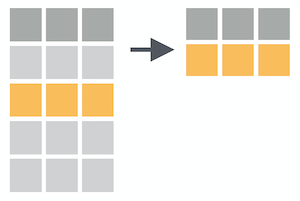
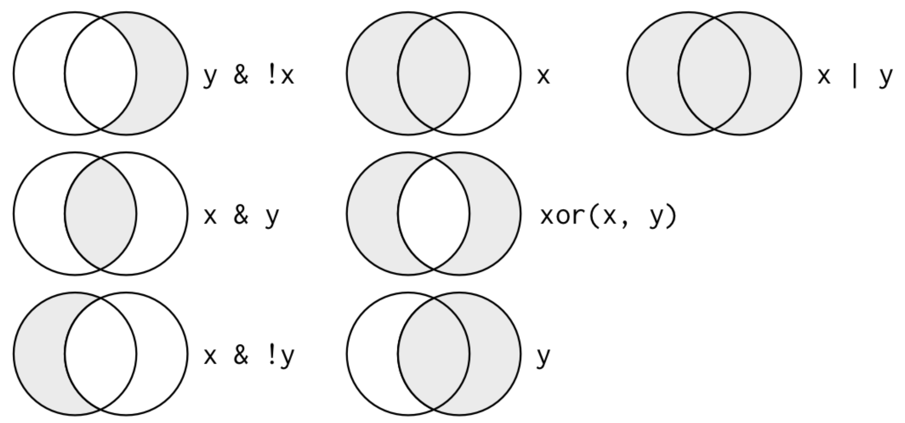
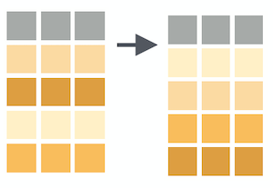
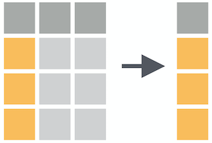
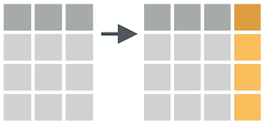
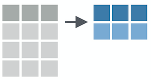
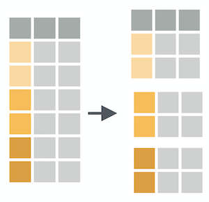
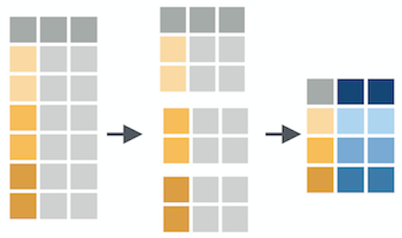

```{r setup, include=FALSE}
options(htmltools.dir.version = FALSE)
library(countdown)
library(tidyverse)
library(palmerpenguins)
library(flair)

xaringanExtra::use_xaringan_extra(include = c("panelset", "tile_view", "share_again"))
xaringanExtra::style_share_again(share_buttons = c("twitter", "linkedin", "pocket"))
xaringanExtra::use_extra_styles(hover_code_line = TRUE, mute_unhighlighted_code = TRUE)

# your turn counter
yt_counter <- 0
```

```{r xaringan-themer, include=FALSE, warning=FALSE}
library(xaringanthemer)
style_mono_accent(base_color = "#23395b",
                text_font_google = google_font("Montserrat", "300", "300i"),
                code_font_google = google_font("Source Code Pro"),
                link_color = "#BA8800",
                code_inline_color = "#BA8800",
                colors = c(
                  blue = "#6495ed",
                  red = "#f34213",
                  purple = "#3e2f5b",
                  orange = "#ff8811",
                  green = "#136f63",
                  white = "#FFFFFF"))
```

class: title-slide, center, middle

# Data Wrangling with `dplyr`

---
background-image: url(images/hex/tidyverse.png)
background-position: 90% 5%
background-size: 10%

# Tidyverse 

There are a few key ideas to be aware of about how the tidyverse works in general before we dive into `dplyr`

--

1. Packages are designed to be like **grammars** for their task. You can string these grammatical elements together to form more complex statements, just like with language.

--

1. The first argument of (basically) every function is `data`. This is very handy, especially when it comes to piping.

--

1. Variable names are usually not quoted (read more [here](https://tidyselect.r-lib.org/reference/language.html))

---
background-image: url(images/hex/palmerpenguins.png)
background-position: 90% 5%
background-size: 10%

# Palmer penguins

```{r warning=FALSE, message=FALSE}
library(palmerpenguins)
glimpse(penguins)
```

---
background-image: url(images/hex/dplyr.png)
background-position: 90% 5%
background-size: 10%

# dplyr

`dplyr` is a grammar of data manipulation, providing a consistent set of core verbs that help you solve the most common data manipulation challenges

--
***

**Manipulating observations**

+ `filter()` picks cases based on their values.

+ `arrange()` changes the ordering of the rows.

--
***

**Manipulating variables**

+ `select()` picks variables based on their names.

+ `mutate()` adds new variables that are functions of existing variables

--
***

**Summarizing data**

+ `summarise()` reduces multiple values down to a single summary.


---
# Concept Map: `dplyr`

```{r echo=FALSE, out.width="90%"}
knitr::include_graphics("images/dplyr.png")
```

.footnote[Source: [rstudio/concept-maps](https://github.com/rstudio/concept-maps)]

---
background-image: url(images/hex/magrittr.png)
background-position: 90% 5%
background-size: 10%

# A review of pipes

`x %>% f(y)` is equivalent to `f(x, y)`

--
***

R Code 

```{r eval=FALSE}
penguins %>% 
  filter(species == "Gentoo") %>% 
  select(bill_length_mm, bill_depth_mm) %>% 
  arrange(desc(bill_length_mm))
```

--

Translated into English

```{r eval = FALSE}
start with penguins data *AND THEN*
  filter to include only observations from Gentoo penguins *AND THEN*
  select only the columns `bill_length_mm` and `bill_depth_mm` *AND THEN*
  arrange observations by descending order of `bill_length_mm`
```

--
***
Read more on piping: [https://magrittr.tidyverse.org/reference/pipe.html](https://magrittr.tidyverse.org/reference/pipe.html)


---
background-image: url(images/hex/magrittr.png)
background-position: 90% 5%
background-size: 10%

# Concept Map: `%>%`

```{r echo=FALSE, out.width="90%"}
knitr::include_graphics("images/pipe-operator.png")
```

.footnote[Source: [rstudio/concept-maps](https://github.com/rstudio/concept-maps)]

---
class: inverse, center, middle

# Manipulating observations <br> (rows)

---
background-image: url(images/hex/dplyr.png)
background-position: 90% 5%
background-size: 10%

# `filter()`

### Subset observations (rows) with `filter()`

```{r echo=FALSE}

```

---
background-image: url(images/hex/dplyr.png)
background-position: 90% 5%
background-size: 10%

# `filter()`

```{r echo=FALSE}
knitr::include_graphics("images/dplyr_filter.jpg")
```

.footnote[Artwork by [@allison_horst](https://twitter.com/allison_horst)]

---
background-image: url(images/hex/dplyr.png)
background-position: 90% 5%
background-size: 10%

# `filter()`

### Logical operators

```{r echo=FALSE}

```

.footnote[Source: [R for Data Science](https://r4ds.had.co.nz/transform.html#filter-rows-with-filter)]

---
background-image: url(images/hex/dplyr.png)
background-position: 90% 5%
background-size: 10%

# `filter()`

### Comparisons

```{r include = FALSE}
comp_table <- tibble::tribble(
  ~Operator, ~Description, ~Usage,
  "<", "less than", "x < y",
  "<=", "less than or equal to", "x <= y",
  ">", "greater than", "x > y",
  ">=", "greater than or equal to", "x >= y",
  "==", "exactly equal to", "x == y",
  "!=", "not equal to", "x != y",
  "%in%", "group membership", "x %in% y",
  "is.na", "is missing", "is.na(x)",
  "!is.na", "is not missing", "!is.na(x)"
)
```


```{r echo = FALSE, results = 'asis'}
knitr::kable(comp_table, format = "html")
```

.footnote[Source: [Alison Hill](https://share-blogdown.netlify.app/slides/02-slides.html#15)]

---
background-image: url(images/hex/dplyr.png)
background-position: 90% 5%
background-size: 10%

# `filter()`

.panelset[

.panel[.panel-name[Arguments]

```{r filter-spec-color-coded, echo = FALSE, warning=FALSE}
decorate('filter(.data, ...)', eval=FALSE) %>% 
  flair(".data", color = "cornflowerblue") %>% 
  flair("...", color = "red")
```

**.blue[.data]** .blue[= a data frame or tibble]

**.red[. . .]**  .red[= Expressions that return a logical value, and are defined in terms of the variables in .blue[.data]. <br><br> If multiple expressions are included, they are combined with the & operator. Only rows for which all conditions evaluate to TRUE are kept. ]
]

.panel[.panel-name[Example 1]

```{r}
penguins %>% 
  filter(species == "Gentoo" & bill_length_mm > 55)
```

]

.panel[.panel-name[Example 2]

```{r}
penguins %>% 
  filter(species %in% c("Adelie", "Gentoo"),
         island %in% c("Dream", "Torgersen"))
```
]
]

---
background-image: url(images/hex/dplyr.png)
background-position: 90% 5%
background-size: 10%

# Concept Map: `filter()`

```{r echo=FALSE, out.width="90%"}
knitr::include_graphics("images/filter.png")
```

.footnote[Source: [rstudio/concept-maps](https://github.com/rstudio/concept-maps)]

---
background-image: url(images/hex/dplyr.png)
background-position: 90% 5%
background-size: 10%

# `arrange()`

### Arrange rows by column values with `arrange()`

```{r echo=FALSE}

```

---
background-image: url(images/hex/dplyr.png)
background-position: 90% 5%
background-size: 10%

# `arrange()`

.panelset[

.panel[.panel-name[Arguments]

```{r arrange-spec-color-coded, echo = FALSE, warning=FALSE}
decorate('arrange(.data, ...)', eval=FALSE) %>% 
  flair(".data", color = "cornflowerblue") %>% 
  flair("...", color = "red")
```

**.blue[.data]** .blue[= a data frame or tibble]

**.red[. . .]**  .red[= Variables to sort by. Use `desc()` to sort a variable in descending order.]
]

.panel[.panel-name[Example 1]

```{r}
penguins %>% 
  filter(species == "Gentoo" & bill_length_mm > 55) %>% 
  arrange(body_mass_g)
```

]

.panel[.panel-name[Example 2]

```{r}
penguins %>% 
  filter(species == "Gentoo" & bill_length_mm > 55) %>% 
  arrange(desc(body_mass_g))
```
]
]

---
class: inverse

# Your turn `r (yt_counter <- yt_counter + 1)`

```{r echo=FALSE}
countdown(minutes = 5)
```

1. Import the file `pragmatic_scales_data.csv` (use best practices of a project-oriented workflow). Save it to an object called `ps_data`. This time we'll save it as a `tibble` (which I've done for you).

1. Filter rows for cases in the "No Label" `condition` and arrange the resulting observations by descending order of `age`.

1. Select observations from the “No Label” condition for kids 3 years old or younger. 

1. Select observations for kids between the ages of 3 and 4. Save the result to a new object called `ps_filtered`. (For an extra challenge, look up the documentation for `between()` and use this function instead of comparison operators). 

---
class: solution

# Solution

```{r echo=FALSE, message=FALSE}
ps_data <- rio::import(here::here("static/slides/data/pragmatic_scales_data.csv")) %>% 
  as_tibble()
```


.panelset[
.panel[.panel-name[Q1]

```{r eval=FALSE}
# Q1.
ps_data <- rio::import(here::here("data", "pragmatic_scales_data.csv")) %>% 
  as_tibble()
```

]

.panel[.panel-name[Q2]

```{r}
# Q2.
ps_data %>% 
  filter(condition == "No Label") %>% 
  arrange(desc(age))
```

]

.panel[.panel-name[Q3]

```{r}
# Q3.
ps_data %>% 
  filter(condition == "No Label" & age >= 3)
```

]

.panel[.panel-name[Q4]

.pull-left[
```{r}
# Q4. 
ps_filtered <- ps_data %>% 
  filter(age >= 3 & age <= 4)

ps_filtered
```
]

.pull-right[
```{r}
# Q4.
ps_filtered <- ps_data %>% 
  filter(between(age, 3, 4))

ps_filtered
```
]
]
]

---
class: inverse, center, middle

# Manipulating variables <br> (columns)

---
background-image: url(images/hex/dplyr.png)
background-position: 90% 5%
background-size: 10%

# `select()`

### Select columns with `select()`

```{r echo=FALSE}

```


---
background-image: url(images/hex/dplyr.png)
background-position: 90% 5%
background-size: 10%

# `select()`

.panelset[

.panel[.panel-name[Arguments]

```{r select-spec-color-coded, echo = FALSE, warning=FALSE}
decorate('select(.data, ...)', eval=FALSE) %>% 
  flair(".data", color = "cornflowerblue") %>% 
  flair("...", color = "red")
```

**.blue[.data]** .blue[= a data frame or tibble]

**.red[. . .]**  .red[= One or more unquoted expressions separated by commas. <br><br> Variable names can be used as if they were positions in the data frame, so expressions like `x:y` can be used to select a range of variables.]
]

.panel[.panel-name[Example 1]

```{r}
penguins %>% 
  filter(species == "Gentoo" & bill_length_mm > 55) %>% 
  arrange(body_mass_g) %>% 
  select(species:bill_depth_mm)
```

]

.panel[.panel-name[Example 2]

```{r}
penguins %>% 
  filter(species == "Gentoo" & bill_length_mm > 55) %>% 
  arrange(body_mass_g) %>% 
  select(species, starts_with("bill_"))
```
]

.panel[.panel-name[Example 3]

```{r}
penguins %>% 
  filter(species == "Gentoo" & bill_length_mm > 55) %>% 
  arrange(body_mass_g) %>% 
  select(ends_with("_mm"))
```
]

]

---
background-image: url(images/hex/dplyr.png)
background-position: 90% 5%
background-size: 10%

# Selection helpers

Selection helpers work in concert with `select()` to make it easier to select specific groups of variables.

--

Here are some commonly useful ones

***

`everything()`: Matches all variables.

`last_col()`: Select last variable, possibly with an offset.

`starts_with()`: Starts with a prefix.

`ends_with()`: Ends with a suffix.

`contains()`: Contains a literal string.

.footnote[`r emo::ji("link")` https://dplyr.tidyverse.org/reference/dplyr_tidy_select.html#overview-of-selection-features]

---
background-image: url(images/hex/dplyr.png)
background-position: 90% 5%
background-size: 10%

# Concept Map: `select()`

```{r echo=FALSE, out.width="90%"}
knitr::include_graphics("images/select.png")
```

.footnote[Source: [rstudio/concept-maps](https://github.com/rstudio/concept-maps)]

---
background-image: url(images/hex/dplyr.png)
background-position: 90% 5%
background-size: 10%

# `mutate()`

### Create (or overwrite) variables with `mutate()`

```{r echo=FALSE}

```

---
background-image: url(images/hex/dplyr.png)
background-position: 90% 5%
background-size: 10%

# `mutate()`

.center[
```{r echo=FALSE, out.width="75%"}
knitr::include_graphics("images/dplyr_mutate.png")
```
]

.footnote[Artwork by [@allison_horst](https://twitter.com/allison_horst)]

---
background-image: url(images/hex/dplyr.png)
background-position: 90% 5%
background-size: 10%

# `mutate()`

.panelset[

.panel[.panel-name[Arguments]

```{r mutate-spec-color-coded, echo = FALSE, warning=FALSE}
decorate('mutate(.data, ...)', eval=FALSE) %>% 
  flair(".data", color = "cornflowerblue") %>% 
  flair("...", color = "red")
```

**.blue[.data]** .blue[= a data frame or tibble]

**.red[. . .]**  .red[=  Name-value pairs. The name gives the name of the column in the output.]

]

.panel[.panel-name[Example 1]

```{r}
penguins %>% 
  filter(species == "Gentoo" & bill_length_mm > 55) %>% 
  arrange(body_mass_g) %>% 
  select(starts_with("bill_")) %>% 
  mutate(bill_length_m = bill_length_mm/1000)
```

]

.panel[.panel-name[Example 2]

```{r}
penguins %>% 
  filter(species == "Gentoo" & bill_length_mm > 55) %>% 
  arrange(body_mass_g) %>% 
  select(starts_with("bill_")) %>% 
  mutate(bill_length_mm = as.character(bill_length_mm))
```
]

]

---
background-image: url(images/hex/dplyr.png)
background-position: 90% 5%
background-size: 10%

# Concept Map: `mutate()`

```{r echo=FALSE, out.width="90%"}
knitr::include_graphics("images/mutate.png")
```

.footnote[Source: [rstudio/concept-maps](https://github.com/rstudio/concept-maps)]


---
class: inverse

# Your turn `r (yt_counter <- yt_counter + 1)`

```{r echo=FALSE}
countdown(minutes = 4)
```

1. In `ps_data`, select only the variables `age` and `condition`. 

1. As we did with indexing in base R, you can use the minus sign (`-`) to "de-select" columns. Keep everything in `ps_data` except `subid` and `condition`. 

1. Select the columns `correct` and `condition` without naming them, using their positions or de-selecting other variables.

1. Use `mutate()` to convert `condition` from type "character" to type "factor". Then check that you've done this successfully. Hint: what function could you pipe to directly to check this? 

---
class: solution

# Solution

.panelset[
.panel[.panel-name[Q1]

```{r}
ps_data %>% 
  select(age, condition)
```


]

.panel[.panel-name[Q2]

```{r}
ps_data %>% 
  select(-c(subid, condition))
```


]

.panel[.panel-name[Q3]

```{r}
ps_data %>% 
  select(starts_with("c"))
```


]

.panel[.panel-name[Q4]

```{r}
ps_data %>% 
  mutate(condition = as.factor(condition)) %>% 
  glimpse()
```

]
]

---
class: inverse, center, middle

# Summarizing data

---
background-image: url(images/hex/dplyr.png)
background-position: 90% 5%
background-size: 10%

# `summarize()`

`summarize()` reduces your raw data frame into to a smaller summary data frame that only contains the variables resulting from the **summary functions** that you specify within `summarize()`

```{r echo=FALSE, out.width="40%"}

```

--
***

Summary functions take vectors as inputs and return single values as outputs

```{r echo=FALSE}

```

Common examples are `mean()`, `sd()`, `max()`, `min()`, `sum()`, etc...


---
background-image: url(images/hex/dplyr.png)
background-position: 90% 5%
background-size: 10%

# `summarize()`

.panelset[

.panel[.panel-name[Arguments]

```{r summarize-spec-color-coded, echo = FALSE, warning=FALSE}
decorate('summarize(.data, ...)', eval=FALSE) %>% 
  flair(".data", color = "cornflowerblue") %>% 
  flair("...", color = "red")
```

**.blue[.data]** .blue[= a data frame or tibble]

**.red[. . .]**  .red[=  Name-value pairs of summary functions. The name will be the name of the variable in the result.]

]

.panel[.panel-name[Example]

```{r}
penguins %>% 
  summarize(mean_bill_length = mean(bill_length_mm, na.rm = TRUE),
            max_flipper_length = max(flipper_length_mm, na.rm = TRUE))
```

]

]

---
background-image: url(images/hex/dplyr.png)
background-position: 90% 5%
background-size: 10%

# `group_by()`

`group_by()` creates groups based on one or more variables in the data, and this affects any downstream operations -- most commonly, `summarize()`

```{r echo=FALSE, out.width="50%"}

```

---
background-image: url(images/hex/dplyr.png)
background-position: 90% 5%
background-size: 10%

# `group_by()`

What happens if we combine `group_by()` and `summarize()`? 

```{r echo=FALSE, out.width="75%"}

```

---
background-image: url(images/hex/dplyr.png)
background-position: 90% 5%
background-size: 10%

# `summarize()`

Let's see a couple examples of how we can combine `group_by()` and `summarize()`

.panelset[

.panel[.panel-name[Example 1]

```{r}
penguins %>% 
  group_by(species) %>% 
  summarize(mean_bill_length = mean(bill_length_mm, na.rm = TRUE))
```

]

.panel[.panel-name[Example 2]

```{r}
penguins %>% 
  group_by(species, island) %>% 
  summarize(mean_bill_length = mean(bill_length_mm, na.rm = TRUE))
```

]


]


---
background-image: url(images/hex/dplyr.png)
background-position: 90% 5%
background-size: 10%

# Concept Map: `summarize()`

```{r echo=FALSE, out.width="90%"}
knitr::include_graphics("images/group_by-summarize.png")
```

.footnote[Source: [rstudio/concept-maps](https://github.com/rstudio/concept-maps)]


---
class: inverse

# Your turn `r (yt_counter <- yt_counter + 1)`

```{r echo=FALSE}
countdown(minutes = 7)
```

1. From `ps_data`, get the total number of correct trials for each subject and call this variable `num_correct`. Hint: you can use the summary function `sum()`. 

1. Now get the total number of correct trials (`num_trials`) for each unique combination of `condition` and `item` and arrange the resulting rows by descending order of `num_correct`. Which combination of condition and item had the most/least correct responses? 

1. Lastly, calculate the proportion of correct responses for each `condition` and call this variable `prop_correct` (hint: because `correct` is coded as 0 and 1, you can do this by taking the mean of `correct`). In the same pipeline, create a bar plot that shows the differences between the mean proportion of correct responses between the two conditions, and color the bars by condition. What do you notice? (hint: it might be more straightforward to use `geom_col` than `geom_bar`)


---
class: solution

# Solution

.panelset[
.panel[.panel-name[Q1]

```{r}
# Q1. 
ps_data %>% 
  group_by(subid) %>% 
  summarize(num_correct = sum(correct))
```


]

.panel[.panel-name[Q2]

```{r}
# Q2. 
ps_data %>% 
  group_by(condition, item) %>% 
  summarize(num_correct = sum(correct)) %>% 
  arrange(desc(num_correct))
```

]

.panel[.panel-name[Q3]

```{r eval=FALSE}
Q3. 
ps_data %>% 
  group_by(condition) %>% 
  summarize(prop_correct = mean(correct)) %>% 
  ggplot(aes(x = prop_correct, y = condition, fill = condition)) + 
  geom_col() + 
  coord_flip()
```

]

.panel[.panel-name[Q3 Plot]

```{r, echo=FALSE, warning=FALSE, message=FALSE, fig.dim=c(4.8, 4.5)}
ps_data %>% 
  group_by(condition) %>% 
  summarize(prop_correct = mean(correct)) %>% 
  ggplot(aes(x = prop_correct, y = condition, fill = condition)) + 
  geom_col() + 
  coord_flip()
```
]

]

---
background-image: url(images/hex/dplyr.png)
background-position: 90% 5%
background-size: 10%

# Column-wise operations

What if we want to apply `dplyr` verbs across multiple columns **simultaneously**? Check out these slides for more `r emo::ji("point_down")`

```{r echo=FALSE}
knitr::include_url("https://columnwise-operations-dplyr.netlify.app/")
```

.footnote[`r emo::ji("link")` [columnwise-operations-dplyr.netlify.app](https://columnwise-operations-dplyr.netlify.app/#1)]

---
class: inverse, center, middle
# Q & A

```{r echo=FALSE}
countdown(minutes = 5)
```

---
class: inverse, center, middle
# Next up...

## Data tidying with `tidyr`

---
class: inverse, center, middle
# Break! 

```{r echo=FALSE}
countdown(minutes = 10)
```

